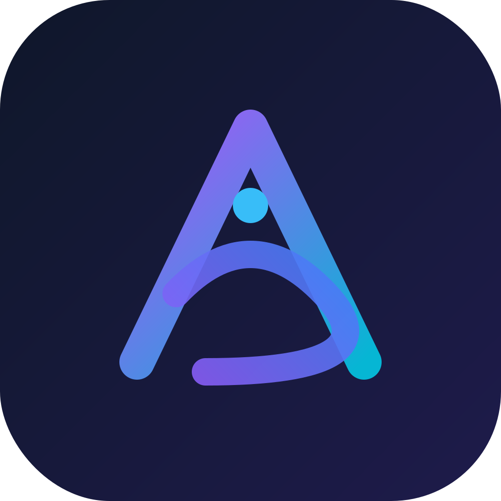
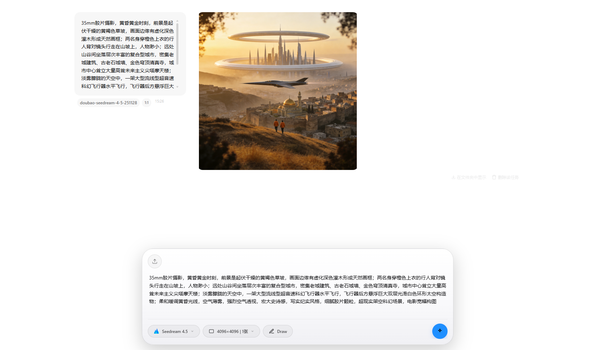
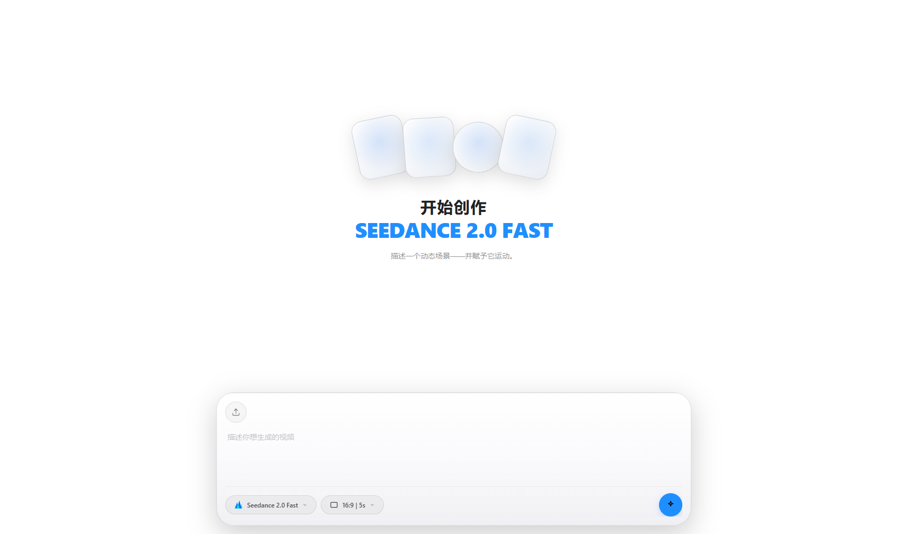
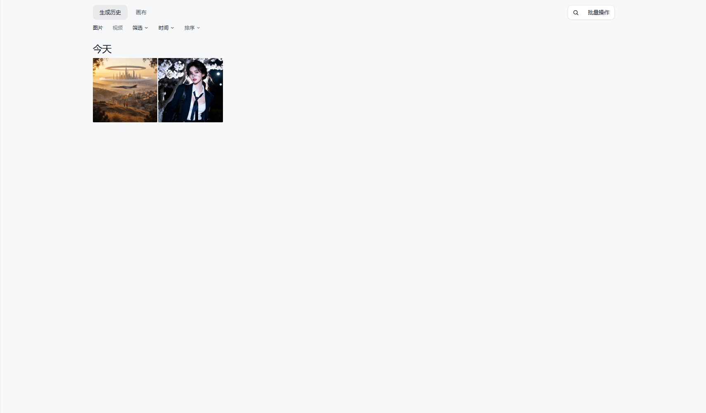

# AI Vision Studio

<p align="center">
  
</p>

> 多供应商 AI 图像 / 视频生成桌面客户端，一站式接入即梦（豆包）、可灵、通义万相、MiniMax 海螺、魔搭，并支持以内置模型为模板自添加模型。


## 截图

| 图像工作室 | 视频工作室 | 图库 |
| --- | --- | --- |
|  |  |  |

## 功能特性

- **统一工作台**：图像 / 视频两个工作室 + 哩布风格图库，文生图、图生图、文生视频、图生视频走同一套界面
- **对话式任务时间线**：每个工作室按会话（Session）组织生成任务，多会话切换、重命名、删除；会话状态持久化，重启后任务仍在
- **多任务并行**：同一会话内可同时发起多个生成任务，独立进度跟踪，互不阻塞
- **实时进度**：异步厂商（视频类）通过事件推送展示生成阶段（提交 → 生成中 → 下载 → 完成）
- **重新生成**：失败或不满意的结果可一键重试，自动回填原提示词与全部参数（含参考图）
- **自添加模型**：无需写代码，以任意内置模型为模板（继承其尺寸机制与参数分区），替换模型 ID / 名称并覆盖默认参数，即可接入同厂商新模型（魔搭模型支持自由参数与 LoRA）
- **图库**：历史作品瀑布流展示，支持收藏、批量操作（删除 / 下载 / 收藏）、按类型 / 比例 / 画质筛选、作品详情面板
- **跨工作室跳转**：图库与结果卡片一键发起"图生视频"、"作为参考图"（图生图）、"重新编辑"（回填原参数）
- **参考图驱动**：图生图 / 图生视频支持多张参考图，本地文件自动转 base64 后交给厂商
- **i18n 与主题**：中 / 英双语（默认中文），暗色 / 浅色 / 跟随系统三档主题
- **BYOK**：自带密钥（Bring Your Own Key），应用本身不持有任何密钥，无自有服务器

## 支持的厂商与模型

| 厂商 | 接入状态 | 图像模型 | 视频模型 |
|------|---------|---------|---------|
| 火山方舟（即梦/豆包） | ✅ | Seedream 5.0 Pro / 5.0 Lite / 4.5 / 4.0 | Seedance 2.0 / 2.0 Fast / 2.0 Mini / 1.5 Pro / 1.0 Pro / 1.0 Pro Fast |
| 可灵 Kling | ✅ | — | Kling 3.0 / 2.6 |
| 通义万相 | ✅ | qwen-image 2.0 / edit / max / plus 系列、wan2.7-image、wan2.6-t2i / wan2.6-image、z-image-turbo（共 13 个） | wan2.7-t2v / wan2.7-i2v |
| MiniMax 海螺 | ✅ | image-01 / image-01-live | Hailuo video-01 |
| 魔搭 ModelScope | ✅ | 魔搭 AIGC 专区模型（含 LoRA） | — |

## 快速开始

### 下载安装

从 [Releases](https://github.com/begonia-474/ai-vision-studio/releases) 页面下载对应平台的安装包即可（Windows / macOS / Linux）。

### 配置 API Key

打开应用 → 左下角「自带密钥（BYOK）」→ 选择厂商，填入对应平台的 API Key 并保存。密钥以明文 JSON 存在本地数据目录（`keys.json`，仅当前用户可读写），不经过任何第三方服务。

### 从源码构建

```bash
npm install          # 安装前端依赖
npm run tauri dev    # 开发模式运行
npm run tauri build  # 打包安装包
```

> 详细开发流程、代码规范见 [CONTRIBUTING.md](CONTRIBUTING.md)；架构设计与开发环境说明见 [docs/architecture.md](docs/architecture.md)。

## 数据与安全

生成产物与历史记录保存在本地，随时可清理。数据根目录因构建形态而异：

| 构建形态 | 数据根目录 |
|------|------|
| 开发（debug） | `<项目根目录>/.data/`（产物/历史一眼可见，随时可删） |
| 发布（Windows） | `%LOCALAPPDATA%\com.aivisionstudio.app\` |
| 发布（Linux） | `~/.local/share/com.aivisionstudio.app\`（遵循 XDG） |
| 发布（macOS） | `~/Library/Application Support/com.aivisionstudio.app/` |

| 数据 | 位置（以发布构建为例） |
|------|------|
| 生成产物 | `<数据根目录>\outputs\YYYY\MM\DD\`（按生成日期归档） |
| 缩略图 | `<数据根目录>\thumbs\`（可再生的预览文件） |
| 参考图收编 | `<数据根目录>\inputs\` |
| 历史记录 / 自添加模型 | `<数据根目录>\history.db` |
| API Key / WorkspaceId | `<数据根目录>\keys.json`（明文 JSON，Unix 上权限 0600） |

- **密钥存储**：API Key / WorkspaceId 以明文 JSON 存于本地 `keys.json`（跨平台一致，不依赖系统凭据管理器）；SQLite 只存生成历史与自添加模型配置，不存任何密钥
- **零服务端**：应用无自有服务器，所有请求直连你配置的厂商 API
- **产物本地归档**：生成结果自动下载到本地并按月份归档，图像产物自动生成缩略图

> 注意：`keys.json` 为明文文件，请确保数据目录仅本用户可访问（Unix 上已自动收紧为 0600）。

## 技术栈

[Tauri 2](https://tauri.app)（Rust 后端 + 系统 WebView）· React 19 + TypeScript + Vite 7 · [shadcn/ui](https://ui.shadcn.com)（Tailwind v4）· react-i18next · SQLite

## 贡献

欢迎提交 Issue 与 PR，详见 [CONTRIBUTING.md](CONTRIBUTING.md)。报告安全问题请见 [SECURITY.md](SECURITY.md)。

## 许可证

[Apache License 2.0](LICENSE) © 2026 [begonia-474](https://github.com/begonia-474)
